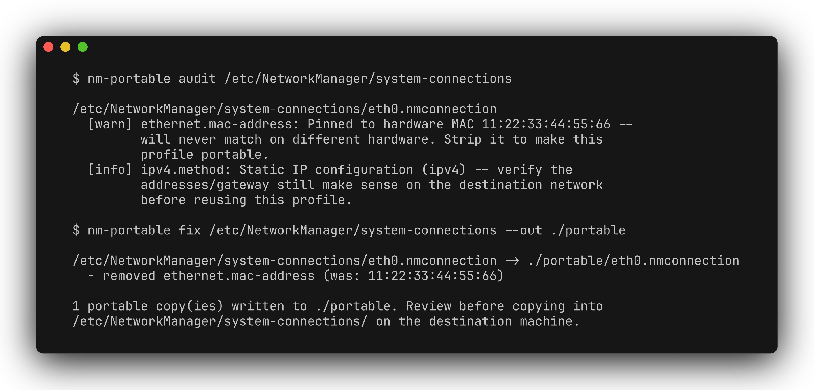

[](README.md) [](README.zh-CN.md)

# nm-portable

在迁移到另一台机器前检查 NetworkManager 的 `.nmconnection` 文件，并按需生成移除硬件绑定字段的副本。适合恢复备份、重新安装系统，或将网络配置迁移到替换设备。



## 安装

需要 Python 3.9+。非 Linux 系统也可以检查导出的文件，但支持的格式是 Linux NetworkManager 的 keyfile。运行时只依赖 Python 标准库。

```bash
git clone https://github.com/zhuhroscar-tech/nm-portable.git
cd nm-portable
python3 -m venv .venv
source .venv/bin/activate
python -m pip install .
```

[GitHub Releases](https://github.com/zhuhroscar-tech/nm-portable/releases) 也提供独立 `.pyz`。运行前请核对同一 release 中的 `SHA256SUMS.txt`。

## 使用

可以指定单个文件或存放导出配置的目录；目录扫描不递归：

```bash
nm-portable audit ./connections
nm-portable audit ./connections --json
nm-portable fix ./connections --out ./portable
nm-portable fix ./connections --out ./portable-auto --strip-static-ip
```

`audit` 只读取文件，报告 MAC address 和 interface name 绑定，提示检查静态 IP，并识别部分明文凭据字段，但不显示这些凭据的值。

`fix` 会移除支持的 MAC 和 interface name 字段，包括写死的 cloned-MAC 硬件地址。若 `cloned-mac-address` 设置为非硬件的特殊值（`preserve`、`permanent`、`random`、`stable`、`stable-ssid`，均为 NetworkManager 自身配置规范定义），该字段会原样保留——因为它在任何硬件上行为一致，往往是用户为 MAC 随机化隐私特性主动设置的，并非可移植性障碍。默认保留静态 IP；指定 `--strip-static-ip` 后，会将 manual IPv4/IPv6 配置改为 `auto`，并移除对应 section 中的其他设置。请检查生成结果，不要假定被移除的设置都不再需要。

Audit 遇到 warning 级别结果或无法读取的文件时返回 **1**，否则返回 **0**。Fix 遇到无法读取的文件，或因输出路径覆盖源文件而拒绝写入时返回 **1**，否则返回 **0**。空目录返回正常并不代表检查过任何配置。

## 安全与部署

请选择独立且不被 NetworkManager 实时使用的输出目录。程序会拒绝直接覆盖源路径，但可能覆盖已有输出文件。副本保留凭据，工具会尝试设置 `600` 权限；请自行确认权限，非 POSIX 文件系统尤其需要注意。读取系统正在使用的配置通常需要更高权限。

工具不联网，也不会 reload 或激活 NetworkManager。请先核对凭据、IP、路由和移除的 MAC 设置，再以正确的所有者和权限手动部署选定文件。激活网络配置可能中断远程连接。

## 开发

```bash
python -m pip install -e '.[dev]'
python -m pytest -v
```

[演示视频](docs/demo.mp4) · [MIT 许可证](LICENSE)。
